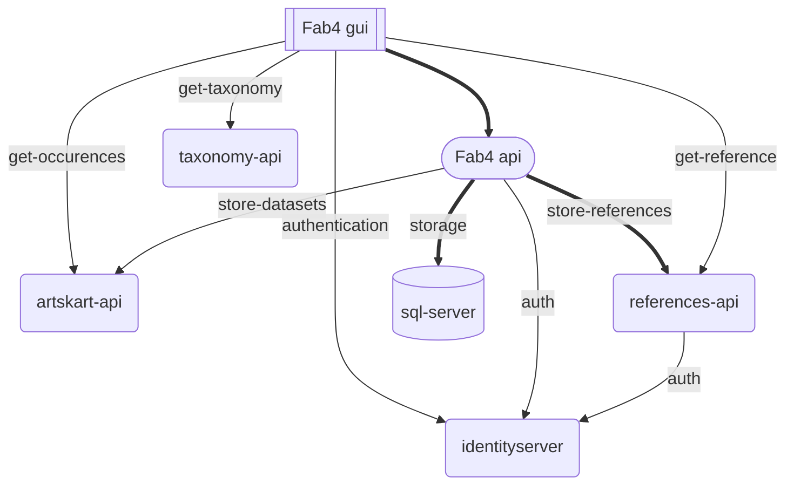

# Fremmedartsbase2023
Arbeidsområde for produksjonsdatabase for Fremmedartsvurderinger frem mot 2023

Testmiljø: https://fab4api.test.artsdatabanken.no/

Løsningen er laget med .net Core 6 og React SPA.
Krever følgende for å kunne bygges:

* [.net core SDK](https://dotnet.microsoft.com/en-us/download)
* [node](https://nodejs.org/en/)

## Arkitektur 


[Projektstruktur](ProjectStructure.md)

Todo: 

* Azure kompatilbel config av database kopling og application insights
* Automagisk Docker image - med klient og avhengigheter + sqllite - slik at 3'dje parter kan teste

## Docker

(dokumentasjon må oppdateres... utdatert)

[Docker image](https://hub.docker.com/r/artsdatabanken/fab4api)

Bygges og publiseres på innsjekk - basert på følgende dockerfil:
[Dockerfile](https://github.com/Artsdatabanken/Fremmedartsbase2023/blob/main/Prod.Api/Dockerfile)


```
docker pull artsdatabanken/fab4api
```

Starte applikasjonen og gjøre den tilgjengelig på port 8888 localhost, samt sette 2 environmentvariabler:

* AuthAuthority: url til autentiseringsserver
* FabDatabase: ConnectionString til sql database instans

```
docker run --name testfab2 -p 8888:3001 -e 'AuthAuthority=https://demo.identityserver.io' -e 'FabDatabase="Data Source = host.docker.internal; Initial Catalog = fab2023; Persist Security Info = True; User ID = fabbase; Password = notapassword; Connection Timeout = 150;"' -it artsdatabanken/fab4api
```


* [Api](http://localhost:8888/swagger/index.html)
* [Test web](http://localhost:8888/index.html)

# Forklaringer og Råd
For forklaring til applikasjonens virkemåte se readme.md under Prod.web
